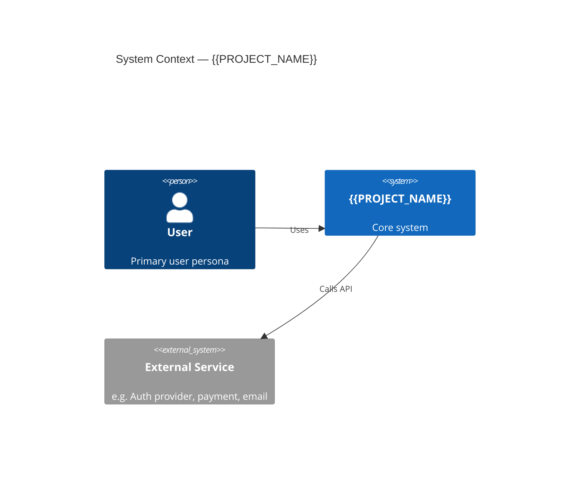
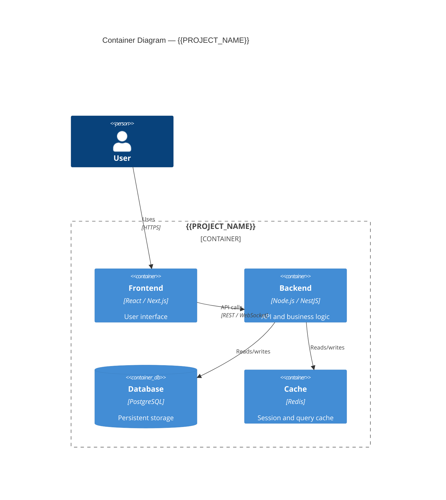
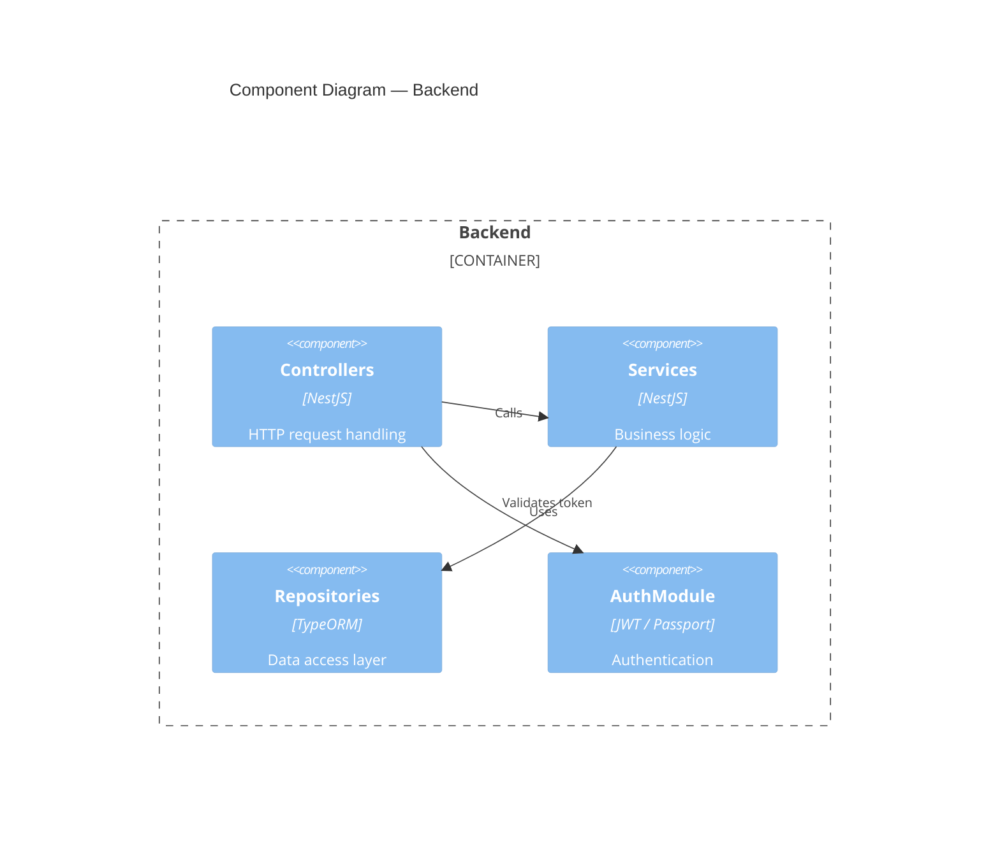

# C4 Architecture Diagrams v1.0.0

**Project:** {{PROJECT_NAME}}
**Version:** v1.0.0
**Date:** {{DATE}}

> Use `/define @175-c4-diagrams-v1.0.0.md` to generate diagrams from the tech stack and PRD.

## Level 1: System Context

Who uses the system and what external systems does it depend on?



## Level 2: Container Diagram

What are the major deployable units (apps, databases, services)?



## Level 3: Component Diagram

What are the major components inside the backend/frontend containers?



## Data Flow Descriptions

### Flow 1: [Name — e.g. User Authentication]

```
User → Frontend → POST /auth/login → AuthService → DB → JWT → Response
```

[Describe the key steps, what data moves, and any transformations]

### Flow 2: [Name]

```
[Describe]
```

## Architecture Notes & Decisions

- [Key architectural decision 1 — link to ADR if applicable]
- [Key architectural decision 2]
- [Known constraints or trade-offs]
