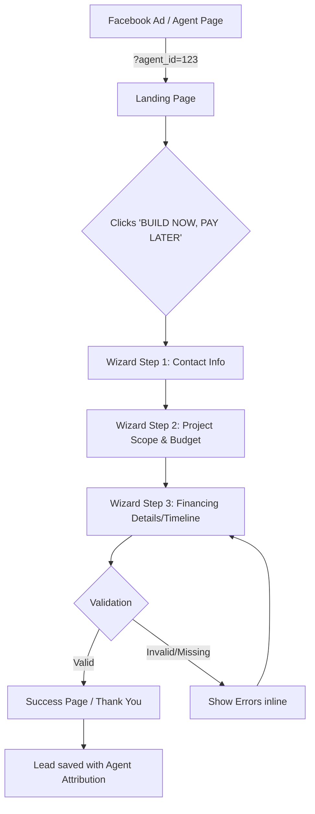
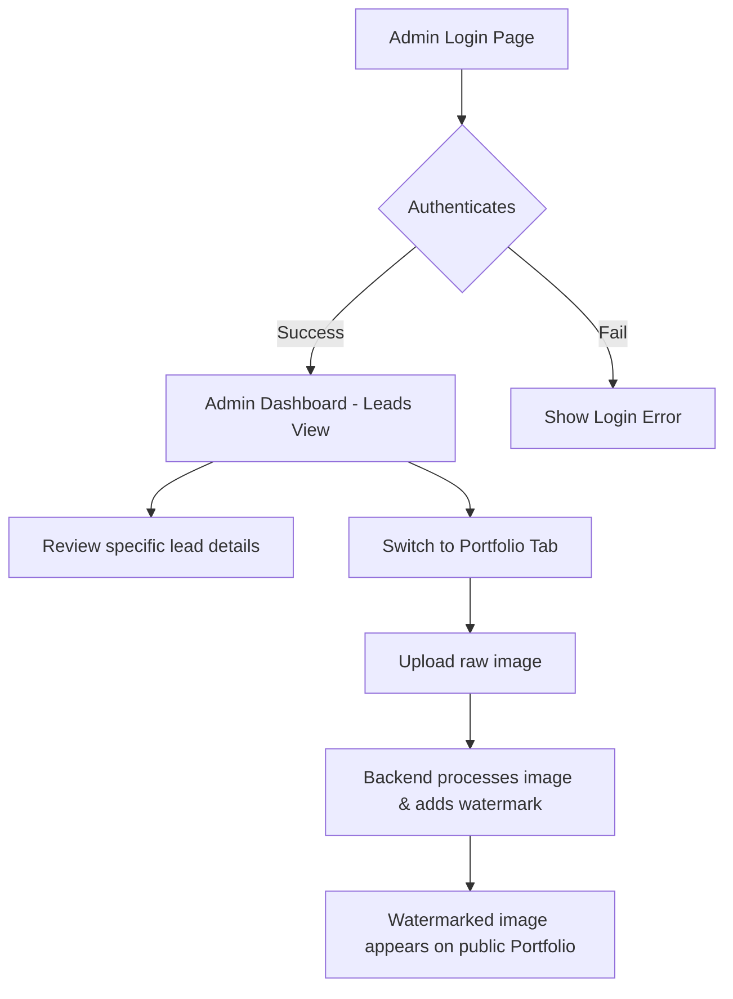

# User Flows v1.0.0

**Project:** Alpton Construction Website & Admin Portal
**Version:** v1.0.0
**Date:** 2026-03-28

> Defined from 001-project-init and 002-prd-v1.0.0 to map out the core journeys and layouts.

## ASCII UI Mockups

### 1. Public Landing & Portfolio Page
```text
+-------------------------------------------------------------+
| [LOGO] Alpton Construction      Portfolio  Services  [Admin]|
+-------------------------------------------------------------+
|                                                             |
|           BUILD YOUR DREAM. WORRY ABOUT COST LATER.         |
|                                                             |
|                  [ BUILD NOW, PAY LATER ] <Primary CTA>     |
|                                                             |
+-------------------------------------------------------------+
| OUR PORTFOLIO                                               |
| +-------------+  +-------------+  +-------------+           |
| |  [WATER   | |  [WATER   | |  [WATER   |           |
| |   MARK]   | |   MARK]   | |   MARK]   |           |
| | Project 1 | | Project 2 | | Project 3 |           |
| +-------------+  +-------------+  +-------------+           |
+-------------------------------------------------------------+
| Footer: Contact, Company Profile, Privacy                   |
+-------------------------------------------------------------+
```

### 2. "BUILD NOW, PAY LATER" Questionnaire Wizard
```text
+-------------------------------------------------------------+
| [LOGO] < Back to Home                                       |
+-------------------------------------------------------------+
|                  Step 2 of 4: Project Scope                 |
|            ===================-------------                 |
|                                                             |
|     What type of construction do you need?                  |
|                                                             |
|      [O] Residential Build                                  |
|      [O] Commercial Renovation                              |
|      [O] Extension / Addition                               |
|                                                             |
|     What is your estimated total budget?                    |
|      [_____________] (Numbers only)                         |
|                                                             |
|                 [ Back ]     [ Next Step ]                  |
|                                                             |
+-------------------------------------------------------------+
```

### 3. Admin Lead Dashboard
```text
+-------------------------------------------------------------+
| Alpton Admin |  [Leads]  [Portfolio DB]          [Sign Out] |
+-------------------------------------------------------------+
| NEW LEADS                                                   |
| +---------------------------------------------------------+ |
| | Date       | Name      | Type        | Est. Budget| Agent |
| |------------|-----------|-------------|------------|-------|
| | 2026-03-28 | J. Doe    | Residential | $150k      | Mark  |
| | 2026-03-28 | S. Smith  | Commercial  | $500k      | Sarah |
| +---------------------------------------------------------+ |
|                                                             |
| UPLOAD PORTFOLIO IMAGE                                      |
|  [ Choose File ] (Will auto-watermark)  [ Upload & Save ]   |
+-------------------------------------------------------------+
```

## Persona Definitions

### Potential Client (Homeowner / Business Owner)
Novice to intermediate technical level. Looking for construction services with flexible financing.

**Motivation Layers:**
| Layer | Question | Answer |
|-------|----------|--------|
| 🎯 **Behavior** | What do they actually do? | Browses construction portfolios and looks for financing options. |
| 💡 **Values** | What do they care about most? | Trust, quality, and financial feasibility. |
| 🧠 **Beliefs** | What do they believe to be true? | Construction is inherently expensive and stressful to fund. |
| 🪞 **Identity** | Who do they see themselves as? | A responsible property owner trying to make a smart investment. |
| ❤️ **Purpose** | Why does any of this matter to them? | Building a safe, beautiful environment for their family or business to thrive. |

### Internal Admin (Alpton Staff)
Intermediate technical level. Responsible for marketing, sales pipeline, and reviewing incoming leads.

**Motivation Layers:**
| Layer | Question | Answer |
|-------|----------|--------|
| 🎯 **Behavior** | What do they actually do? | Reviews site form submissions and uploads new project photos. |
| 💡 **Values** | What do they care about most? | Efficiency, time-saving, and protecting company IP (photos). |
| 🧠 **Beliefs** | What do they believe to be true? | Most form submitters are unqualified, so sorting them quickly is paramount. |
| 🪞 **Identity** | Who do they see themselves as? | The gatekeeper of Alpton's brand and sales pipeline. |
| ❤️ **Purpose** | Why does any of this matter to them? | Growing the business predictably without wasting time on bad leads. |

## User Journeys

### Journey 1: "BUILD NOW, PAY LATER" Inquiry Flow

**Persona:** Potential Client
**Goal:** Submit a pre-qualification request for construction financing.

**Why This Journey Matters:**
| Layer | Insight |
|-------|---------|
| 🎯 **Behavior** | Sees the CTA banner on the homepage. |
| 💡 **Values** | Validates that they can afford their dream project. |
| 🧠 **Beliefs** | Challenges the belief that "I can't afford to build right now." |
| 🪞 **Identity** | Empowers them as a proactive planner. |
| ❤️ **Purpose** | The moment they see a path to achieving their dream. |



**Steps:**
1. User clicks a link from a Facebook Ad or an Agent's Facebook page containing a tracking parameter (e.g., `?agent=mark_s`).
2. User lands on the SPA. The app stores the agent tracking ID in local state/session.
3. User clicks the primary CTA on the landing page or services page.
4. User enters contact information and clicks "Next".
5. User selects project type and provides budget numbers.
6. User submits the final step. System saves the lead to the database and automatically assigns it to the attributed sales agent.

**Success Condition:** User reaches the "Thank You" screen; lead appears in Admin Panel.
**Failure Conditions:** User abandons the flow halfway (metrics drop-off), or validation fails due to missing inputs.

### Journey 2: Review Leads & Manage Portfolio

**Persona:** Internal Admin
**Goal:** Process a new lead and upload a recent project photo with a watermark.



**Steps:**
1. Admin logs in with secure credentials.
2. Admin sees the new submissions in a table. Clicks "Review" to see full questionnaire answers.
3. Admin navigates to "Portfolio DB" section to add a newly completed project.
4. Admin uploads a raw photo; the system automatically applies the Alpton watermark and saves it.

**Success Condition:** The lead is processed, and the public site instantly reflects the new watermarked photo.
**Failure Conditions:** The image file is too large/wrong format, triggering an error message before upload.

## Edge Cases & Error Flows

| Scenario | Trigger | Expected Behavior |
|----------|---------|-------------------|
| **Form Abandonment** | User closes tab midway through wizard. | Data is not saved (or saved as partial lead if tracking is implemented in v1.1.0). |
| **Invalid Image Upload** | Admin uploads a `.pdf` or `>10MB` file. | UI displays "Invalid file type/size" and blocks the upload attempt. |
| **Unauthorized Access** | Non-admin tries to hit `/admin` route. | Returns 403 or redirects to `/login`. |
| **Watermark Failure** | Backend processing node crashes during upload. | Displays error to admin: "Failed to process image. Please try again." Doesn't show unwatermarked image publicly. |

## Navigation & Sitemap

```text
[Main Application SPA]
├── / (Home / Landing Page)
│   ├── Portfolio Section
│   ├── Services Section
│   └── Company Profile
├── /build-now-pay-later (Wizard Flow)
│   ├── /step-1
│   ├── /step-2
│   └── /success
└── /admin (Secure Area)
    ├── /login
    ├── /dashboard (Leads)
    └── /portfolio-management
```
