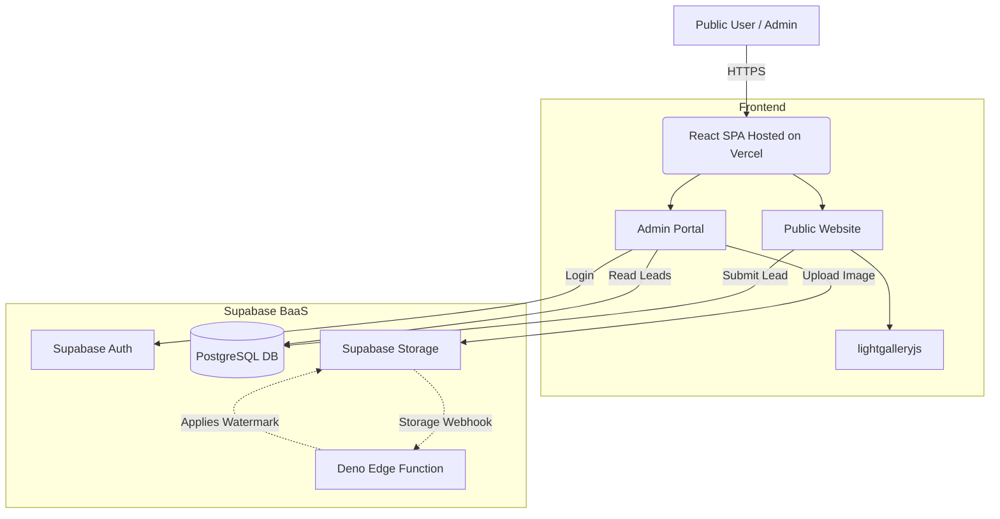

# Tech Stacks v1.0.0

**Project:** Alpton Construction Website & Admin Portal
**Version:** v1.0.0
**Date:** 2026-03-28

> Defined based on PRD requirements and the goal of maintaining a highly cost-effective, easily deployable infrastructure.

## Architecture Decision: React + Supabase

We are proceeding with a **Serverless Architecture** relying entirely on ReactJS for the frontend and Supabase for the backend (Database, Auth, Storage, and Edge Functions). 

While initially considering a dedicated NestJS backend, dropping NestJS completely reduces hosting costs, deployment complexity, and development time. Complex backend tasks (like automatically watermarking uploaded portfolio images) will instead be offloaded to **Supabase Edge Functions** attached to storage webhook triggers.

## Frontend

| Technology | Version | Justification |
|-----------|---------|---------------|
| **Framework** | React 18 / Vite | Fast build times, robust SPA ecosystem, deeply understood by AI tools. |
| **Language** | TypeScript | Type safety for API data models (Leads, Portfolio). |
| **Styling** | Vanilla CSS / CSS Modules | Strict adherence to the Architectural Monolith design system tokens without utility-class bloat. |
| **Gallery** | `lightgalleryjs` | Best-in-class, touch-friendly, immersive portfolio image viewing. |
| **State Management**| Zustand / Context | Lightweight global state for Admin authentication session. |
| **Routing** | React Router v6 | Standard, reliable client-side routing for SPA and Administration portal. |

## Backend & Database (Supabase)

| Technology | Version | Justification |
|-----------|---------|---------------|
| **Backend as a Service**| Supabase | All-in-one open-source Firebase alternative (Postgres + Auth + Storage). |
| **Primary DB** | PostgreSQL | Native to Supabase. Relational structure perfect for tracking Leads and Assets. |
| **Authentication** | Supabase Auth | Built-in (GoTrue), highly secure JWT-based admin login. |
| **Storage** | Supabase Storage | S3-compatible bucket for storing high-res portfolio images. |
| **Serverless Compute**| Supabase Edge Functions | (Deno) Used exclusively to intercept image uploads and apply Alpton watermarks on the fly. |

## Costing Strategy

The primary goal is extreme cost-effectiveness without sacrificing the premium feel or performance of the site.

### Option A: React + Supabase Only (Recommended & Adopted)
By eliminating the NestJS middleman, we achieve an extraordinarily lean infrastructure.
- **Frontend Hosting (Vercel / Netlify):** Free Tier ($0/mo) covers vast amounts of SPA bandwidth.
- **Backend / Database (Supabase):** Free Tier ($0/mo) covers up to 500MB DB space, 50,000 monthly active users, and 1GB of file storage. 
- **Watermarking Compute:** Supabase Edge Functions allow up to 500k free invocations/month.
- **Estimated Total Cost:** **$0/month** until significantly scaling. (Supabase Pro upgrade is a flat **$25/month** if limits are hit).

### Option B: React + NestJS + Supabase (Discarded)
- **Frontend:** Free ($0/mo).
- **Supabase DB:** Free ($0/mo).
- **NestJS Node Server:** Must be hosted on Render, Railway, DigitalOcean, or AWS AppRunner. A production-ready instance that doesn't "sleep" (to avoid cold starts) typically costs **$5 to $20/month**. 
- **Downsides:** Adds deployment complexitiy, doubles the CI/CD pipelines, and creates a failure point for APIs. Therefore, it is strongly recommended to skip NestJS.

## System Architecture Diagram

## Testing Tools

| Layer | Tool | Version | Justification |
|-------|------|---------|---------------|
| Unit (FE) | Vitest | Latest | Native Vite support, faster than Jest. |
| End-to-End | Playwright | Latest | Comprehensive browser testing for critical flows (Inquiry Wizard & Admin Login). |

## DevOps & Infrastructure

| Area | Technology | Justification |
|------|-----------|---------------|
| Cloud Provider | Vercel (FE) + Supabase | Lowest friction deployment for React + Serverless architectures. |
| CI/CD | GitHub Actions | Automatic preview deployments on PRs. |
| Monitoring | Sentry | Free tier is sufficient for tracking frontend React errors. |
