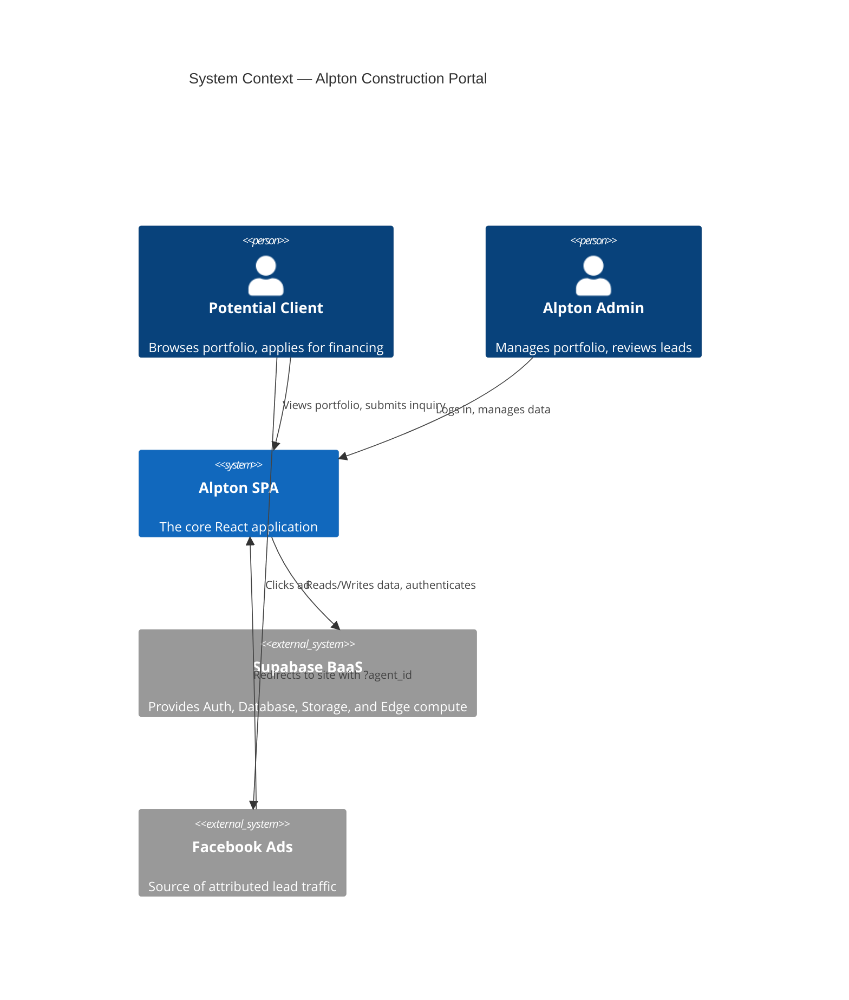
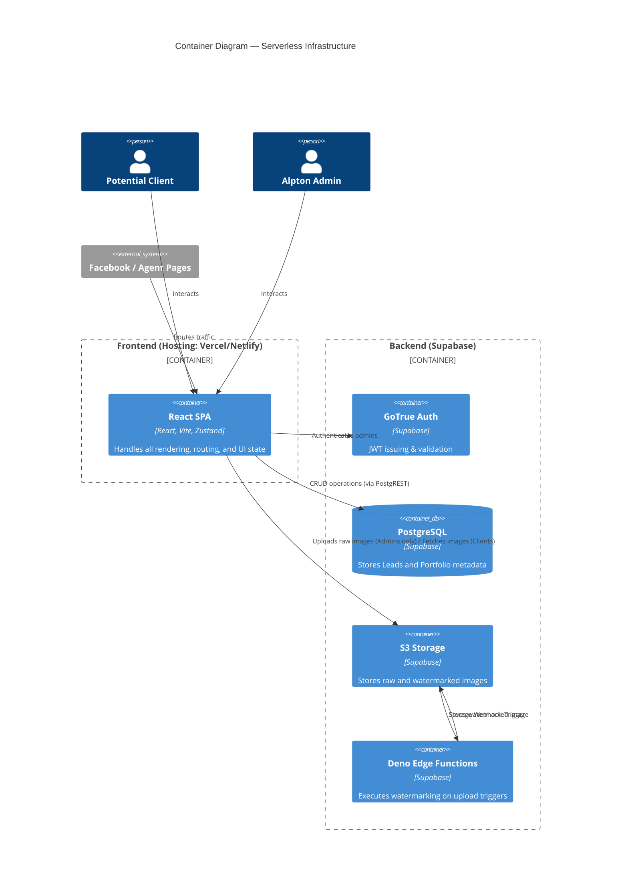
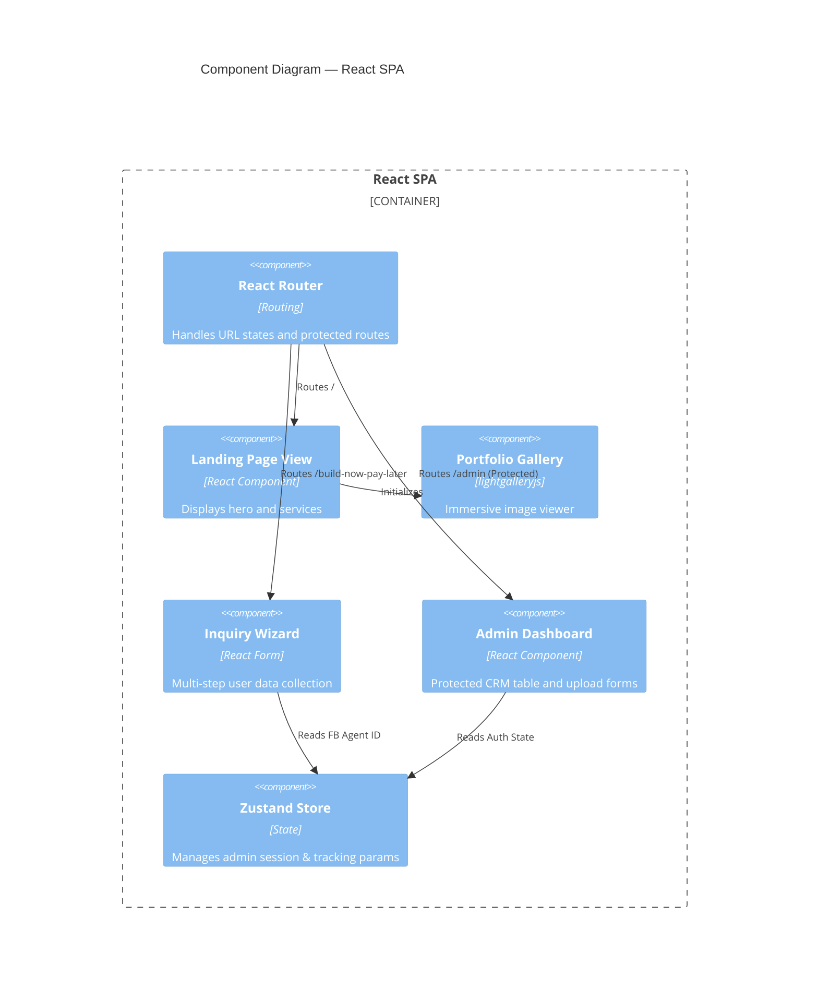

# C4 Architecture Diagrams v1.0.0

**Project:** Alpton Construction Website & Admin Portal
**Version:** v1.0.0
**Date:** 2026-03-28

> Defined based on the React + Supabase Serverless Architecture.

## Level 1: System Context



## Level 2: Container Diagram



## Level 3: Component Diagram



## Data Flow Descriptions

### Flow 1: Lead Submission with Agent Attribution

```text
Facebook Ad -> SPA (Extracts ?agent_id & Saves to Zustand) -> User Fills Wizard -> SPA maps User Data + agent_id -> POST to Supabase DB -> Lead Created
```

- When a user clicks a Facebook link, the SPA's router extracts the `agent` parameter and stores it in the global state/session.
- The user progresses through the "BUILD NOW, PAY LATER" wizard.
- On step submission, the SPA bundles the form data with the tracked `agent_id` and makes a direct PostgREST call to the Supabase PostgreSQL database.

### Flow 2: Automated Portfolio Watermarking

```text
Admin -> SPA Uploads Image -> Supabase Storage (Bucket) -> Triggers Deno Edge Function -> Applies Watermark -> Saves to Public Bucket -> DB Updated
```

- An authenticated Admin uploads a raw project photo directly to a private Supabase Storage bucket.
- Supabase triggers a webhook to a Deno Edge Function.
- The Edge function downloads the image, composites the Alpton logo/watermark over it, and saves the final result to the public portfolio bucket.
- The Edge function then inserts a record into the PostgreSQL `portfolio_assets` table with the public URL.

## Architecture Notes & Decisions

- **Serverless Paradigm:** Evaluated and intentionally discarded NestJS to remove idle compute costs and deployment complexity (See Tech Stacks).
- **Edge Compute:** Watermarking via Supabase Edge Functions ensures the SPA client isn't bogged down by heavy image processing libraries (e.g., HTMLCanvas operations), creating a more reliable admin experience.
