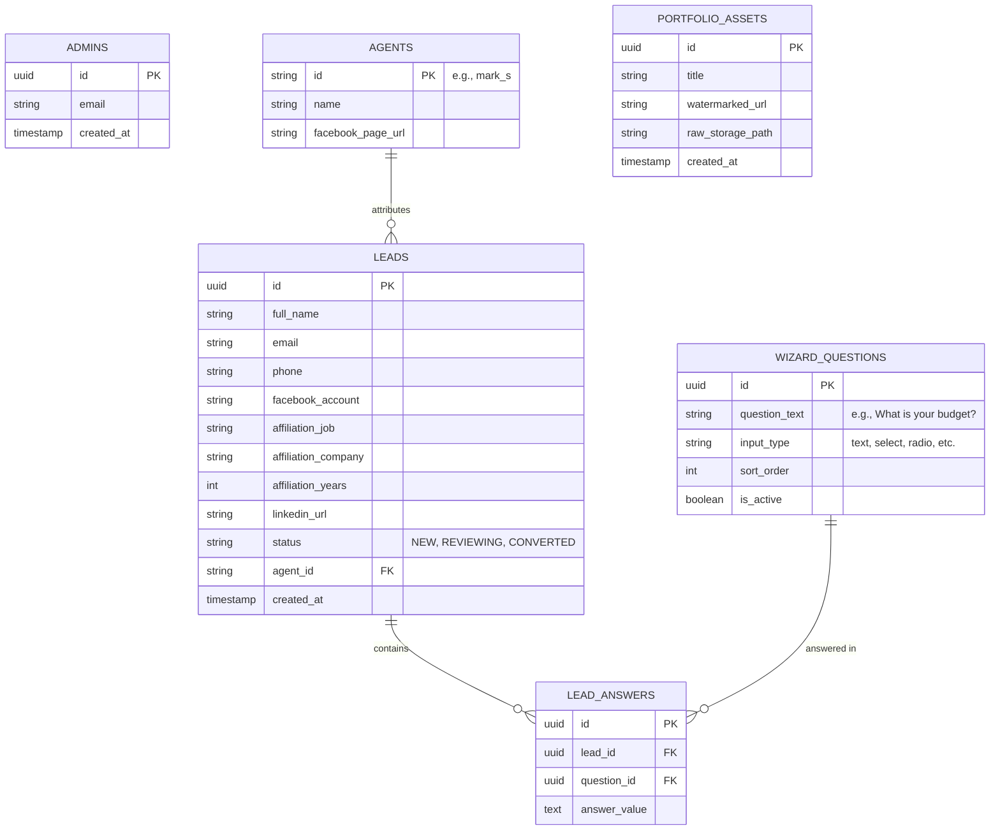

# Database Schema v1.0.0

**Project:** Alpton Construction Website & Admin Portal
**Version:** v1.0.0
**Date:** 2026-03-28

> Defined based on PostgreSQL via Supabase.

## Entity Relationship Diagram

## Table Definitions

### `agents`
Tracks sales representatives and attribution IDs linked from Facebook.
| Column | Type | Description |
|--------|------|-------------|
| `id` | VARCHAR | Primary key, exactly matches the `?agent=` URL parameter |
| `name` | VARCHAR | Human readable name (e.g., "Mark Stevens") |

### `leads`
Stores core identity and tracking data from the "BUILD NOW, PAY LATER" wizard.
| Column | Type | Description |
|--------|------|-------------|
| `id` | UUID | PK |
| `full_name` | VARCHAR | Full Name |
| `email` | VARCHAR | Contact Email |
| `phone` | VARCHAR | Mobile or Phone Number |
| `facebook_account` | VARCHAR | User's fb profile name/link |
| `affiliation_job` | VARCHAR | Job Title |
| `affiliation_company` | VARCHAR | Company / Business Name |
| `affiliation_years` | INT | Years of affiliation |
| `linkedin_url` | VARCHAR | Other references |
| `status` | VARCHAR | Default: 'NEW' |
| `agent_id` | VARCHAR | FK -> `agents.id` (Nullable for organic traffic) |
| `created_at` | TIMESTAMPTZ | Default: `NOW()` |

### `wizard_questions`
Stores the dynamic questions presented in the "BUILD NOW, PAY LATER" inquiry flow.
| Column | Type | Description |
|--------|------|-------------|
| `id` | UUID | PK |
| `question_text` | TEXT | The prompt shown to the user |
| `input_type` | VARCHAR | e.g., 'text', 'radio', 'dropdown', 'currency' |
| `sort_order` | INT | Defines the sequence of the wizard steps |
| `is_active` | BOOLEAN | Allows admins to toggle questions on/off |

### `lead_answers`
Stores the exact answers provided by the user mapped to the dynamic questions.
| Column | Type | Description |
|--------|------|-------------|
| `id` | UUID | PK |
| `lead_id` | UUID | FK -> `leads.id` ON DELETE CASCADE |
| `question_id` | UUID | FK -> `wizard_questions.id` |
| `answer_value` | TEXT | The user's input/selection |

### `portfolio_assets`
Stores references to the watermarked images displayed via `lightgalleryjs`.
| Column | Type | Description |
|--------|------|-------------|
| `id` | UUID | PK |
| `title` | VARCHAR | Alt text or caption |
| `watermarked_url` | TEXT | Public URL served to the frontend |

## Data Validation Rules (Row Level Security)

**Table `leads` and `lead_answers`:** `ENABLE ROW LEVEL SECURITY`. 
- Policy (Insert): `true` (Anonymous users can insert).
- Policy (Select): `auth.role() == 'authenticated'` (Only logged-in admins can view the dashboard and submitted answers).

**Table `wizard_questions`:** `ENABLE ROW LEVEL SECURITY`.
- Policy (Select): `true` (Public API access to render the dynamic frontend wizard).
- Policy (Insert/Update/Delete): `auth.role() == 'authenticated'` (Only logged-in admins can modify the questionnaire).

**Table `portfolio_assets`:** `ENABLE ROW LEVEL SECURITY`.
- Policy (Select): `true` (Public API access for drawing the gallery).
- Policy (Insert): `auth.role() == 'authenticated'` (Admins & Edge functions only).
